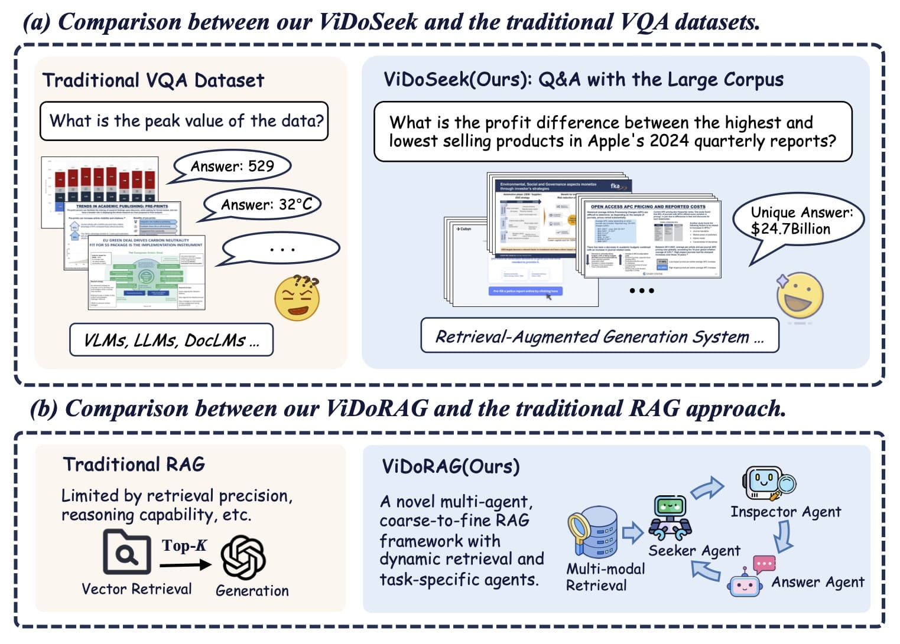
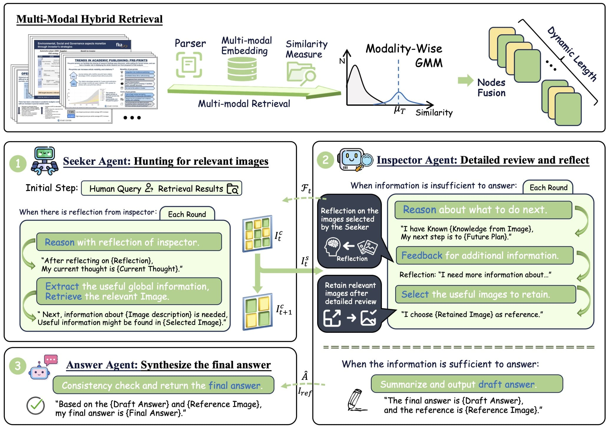

Here’s a more **technical and elaborated version** of your README for ViDoRAG, enhancing clarity, structure, and details for researchers or engineers who want to reproduce or extend your work:

---

# ViDoRAG: Visual Document Retrieval-Augmented Generation via Dynamic Iterative Reasoning Agents

<div align="center">
<a href='https://huggingface.co/datasets/autumncc/ViDoSeek'></a>
<a href='https://arxiv.org/abs/2502.18017'></a>
</div>

<div align="center">
<p>
  
</p>
</div>

---

## 🚀 Overview

Modern document intelligence requires integrating **textual content** and **visual layouts**, especially for multi-page PDFs, scanned documents, or visually rich scientific papers. Traditional retrieval and generation approaches often fail to account for **visual structures** like tables, charts, and multi-hop references.

ViDoRAG addresses these challenges with:

1. **ViDoSeek Dataset** – A benchmark for visually rich document retrieval, reasoning, and answer generation. It is designed for evaluating **Retrieval-Augmented Generation (RAG)** systems across complex queries requiring multi-hop reasoning.

2. **Dynamic Multi-Agent RAG Framework** – ViDoRAG introduces a **multi-agent, actor-critic paradigm** where agents iteratively refine reasoning steps, enhancing **noise robustness** and multi-step reasoning across documents.

3. **Hybrid Multi-Modal Retrieval Strategy** – A **Gaussian Mixture Model (GMM)-based hybrid retrieval** combines textual embeddings and visual embeddings, improving recall for visually structured documents.

4. **State-of-the-Art Performance** – Extensive experiments show ViDoRAG achieves over **10% improvement** compared to strong baselines on ViDoSeek.

---

## 🔍 ViDoSeek Dataset

ViDoSeek contains **visually rich documents** with multi-modal queries. Each query in the dataset includes:

* **Unique Answer**: The exact reference answer for evaluation.
* **Reference Pages**: Pages in the document where the answer is found.
* **Metadata**: Includes file name, source type, and query type.

### Example JSON entry:

```json
{
    "uid": "04d8bb0db929110f204723c56e5386c1d8d21587_2",
    "query": "What is the temperature of Steam explosion of Pretreatment for Switchgrass and Sugarcane bagasse preparation?", 
    "reference_answer": "195-205 Centigrade", 
    "meta_info": {
        "file_name": "Pretreatment_of_Switchgrass.pdf", 
        "reference_page": [10, 11], 
        "source_type": "Text", 
        "query_type": "Multi-Hop" 
    }
}
```

### Dataset Access & Preprocessing

Download the dataset and annotations using:

```bash
bash scripts/ViDoSeek_down.sh
```

Convert documents to images for visual processing:

```bash
python ./scripts/pdf2images.py
```

Perform OCR on images:

```bash
# Traditional OCR
python ./scripts/ocr_triditional.py 

# Vision-Language Model-based OCR (optional)
python ./scripts/ocr_vlms.py
```

> Using VLMs for OCR allows extracting semantic-rich embeddings from visually structured content like tables, figures, or diagrams.

---

## 💻 ViDoRAG Framework

ViDoRAG is a **retrieval-augmented generation system** optimized for **visually rich document reasoning**. Its architecture includes:

1. **Multi-Modal Retriever** – Combines textual embeddings and visual embeddings using a **GMM-based hybrid strategy** to select the most relevant document segments.
2. **Multi-Agent Generation** – Agents iteratively reason over retrieved content, using actor-critic mechanisms to refine outputs and handle noisy or ambiguous information.
3. **Evaluation Module** – LLM-based evaluation measures retrieval accuracy, reasoning correctness, and answer generation quality.

<div align="center">
<p>
  
</p>
</div>

---

### 🔧 Dependencies

```bash
# Create conda environment
conda create -n vidorag python=3.10
conda activate vidorag

# Clone repository
git clone https://github.com/alibaba-nlp/ViDoRAG.git
cd ViDoRAG

# Install dependencies
pip install -r requirements.txt
```

Alternatively, using **uv**:

```bash
pip install uv
uv venv -p 3.10
uv sync
```

> ⚠️ Note: Transformer, Llama Index, Colpali Engine, and Qwen 2.5 versions may be incompatible. Consider separate environments for **retrieval** and **generation**.

---

## ⚡ Step-by-Step Usage

### Step 1: Build Index Database

The framework uses **Llama-Index** for document embeddings. Before full ingestion:

```python
# Check embedding model loading
python ./llms/vl_embedding.py
```

Embed all documents:

```python
python ./ingestion.py
```

This step produces multi-modal embeddings stored in a **searchable database**.

---

### Step 2: Run Multi-Modal Retrieval

#### Single-Modal Retrieval

```python
from search_engine import SearchEngine

search_engine = SearchEngine(dataset='ViDoSeek', node_dir_prefix='colqwen_ingestion', embed_model_name='vidore/colqwen2-v1.0')
results = search_engine.search('some query')
```

#### Dynamic Single-Modal Retrieval (GMM)

```python
search_engine.gmm = True
search_engine.input_gmm = 20
results = search_engine.search('some query')
```

#### Hybrid Multi-Modal Retrieval

```python
from search_engine import HybridSearchEngine

hybrid_engine = HybridSearchEngine(
    dataset='ViDoSeek', 
    embed_model_name_vl='vidore/colqwen2-v0.1', 
    embed_model_name_text='BAAI/bge-m3', 
    gmm=True
)
hybrid_results = hybrid_engine.search('some query')
```

---

### Step 3: Multi-Agent Generation

```python
from llms.llm import LLM
from vidorag_agents import ViDoRAG_Agents

vlm = LLM('qwen-vl-max')
agent = ViDoRAG_Agents(vlm)

answer = agent.run_agent(
    query='Who is Tim?',
    images_path=[
        './data/ExampleDataset/img/00a76e3a9a36255616e2dc14a6eb5dde598b321f_1.jpg',
        './data/ExampleDataset/img/00a76e3a9a36255616e2dc14a6eb5dde598b321f_2.jpg'
    ]
)
print(answer)
```

> Agents iteratively refine answers using **actor-critic reasoning**, incorporating retrieved multi-modal evidence.

---

### Step 4: Evaluation

Evaluate the system end-to-end using LLM-based metrics:

```bash
python eval.py \
  --experiment_type vidorag \
  --dataset ViDoSeek \
  --embed_model_name_vl vidore/colqwen2-v0.1 \
  --embed_model_name_text BAAI/bge-m3 \
  --generate_vlm gpt-4o
```

Supported `experiment_type` values:

* `retrieval_infer` – Single-step retrieval evaluation
* `dynamic_hybrid_retrieval_infer` – Multi-modal dynamic retrieval evaluation
* `vidorag` – Full end-to-end multi-agent generation evaluation

---

## 🧩 Key Contributions

1. **ViDoSeek Dataset** – Multi-modal, multi-hop queries with visual layout awareness.
2. **ViDoRAG Framework** – First multi-agent, iterative reasoning system for visually rich RAG.
3. **GMM Hybrid Retrieval** – Dynamically balances textual and visual embeddings to maximize recall.
4. **Robust Evaluation** – LLM-based assessment framework for automatic reasoning verification.

---

## 📚 References

* ViDoRAG Paper: [arXiv:2502.18017](https://arxiv.org/abs/2502.18017)
* Hugging Face Dataset: [ViDoSeek](https://huggingface.co/datasets/autumncc/ViDoSeek)
* Llama Index: [https://github.com/jerryjliu/llama\_index](https://github.com/jerryjliu/llama_index)
* Colpali Engine: [https://github.com/illuin-tech/colpali](https://github.com/illuin-tech/colpali)

---

